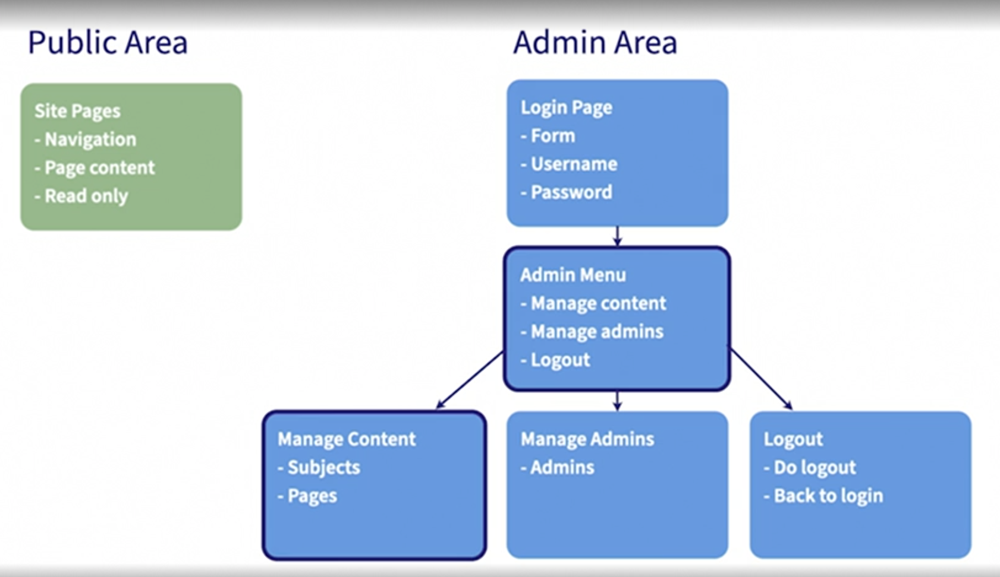

## CMS Project Structure

### Public area:
#### - navigation
#### - page conytent
#### - read only

### Admin Area
#### Login Page: form, username, password
#### Admin menu => manage content, manage admins, logou
####               manage content => subjects, pages
####               manage admins => admins
####               logout => do logout, back to login

Try this markdown:

